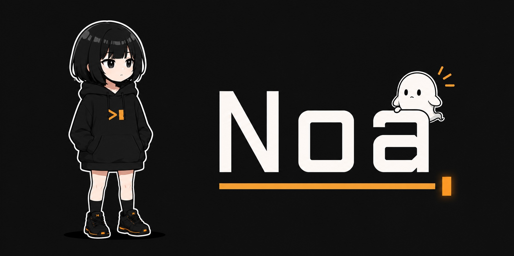

# Noa

Noa is a GPU-accelerated terminal emulator for macOS, implemented independently
in Rust with `winit` and `wgpu`. It aims for observable compatibility with
[Ghostty](https://ghostty.org) while keeping the core terminal model reusable
and testable.

Noa is under active development and is currently built from source. The macOS
app bundle targets macOS 13 or later. Fixture-based regression tests cover
terminal behavior; automated differential comparison against Ghostty is still
planned.

## Quick start

Use a current stable Rust toolchain with Rust 2024 edition support.

```bash
cargo run -p noa
```

To build a double-clickable macOS app:

```bash
scripts/bundle-macos.sh
open target/release/Noa.app
```

The bundle script creates a local ad-hoc-signed app. It is not a notarized
distribution workflow.

## Install with Homebrew

Noa currently supports Apple Silicon Macs. Install the cask from this source
repository as a custom tap:

```bash
brew tap simota/noa https://github.com/simota/Noa.git
brew install --cask simota/noa/noa
```

Installation requires a GitHub Release for the version declared in
`Casks/noa.rb`, containing `Noa-<version>-macos-arm64.zip`. Maintainers create
it by pushing a `v<workspace-version>` tag; the release workflow verifies that
the Cargo, Cask, tag, and app-bundle versions match before publishing the
archive and its SHA-256 checksum.

The cask temporarily uses `sha256 :no_check` because no release archive exists
yet. Replace it with the published checksum after the first release. Release
artifacts are currently ad-hoc signed; Developer ID signing and notarization
are still required for a prompt-free Gatekeeper experience after download.

## Key features

- GPU-rendered terminal grid with Kitty graphics support
- Tabs, splits, multiple windows, session restore, and a quick terminal
- DEC/ANSI VT handling, Kitty keyboard protocol, shell integration, and search
- Font fallback, ligatures, background images, opacity, and blur
- Ghostty-compatible configuration, live reload, and 574 bundled themes
- macOS menus, command palette, notifications, and secure keyboard entry

See [Features](docs/FEATURES.md) for the complete feature inventory.

## Configuration

Noa reads its configuration from `$XDG_CONFIG_HOME/noa/config`, or
`~/.config/noa/config` when `XDG_CONFIG_HOME` is unset. CLI flags override file
values.

```conf
window-width = 100
window-height = 30
font-size = 15.0
theme = "Catppuccin Mocha"
```

Useful one-shot queries include `+version`, `+list-themes`, `+list-keybinds`,
`+list-fonts`, `+show-config`, `+list-actions`, and `+help`. Use
`--import-ghostty-config` to migrate supported settings from an existing
Ghostty configuration.

See the [Configuration reference](docs/CONFIGURATION.md) for supported keys and
defaults, and [Keybindings](docs/KEYBINDINGS.md) for shortcuts and actions.

## Compatibility and limitations

Noa is an independent reimplementation and does not include or link Ghostty
source code. Compatibility work focuses on observable terminal behavior rather
than source-level equivalence.

- The application and packaging workflow are macOS-first.
- Current parity protection is fixture-based; the automated Ghostty oracle is
  not implemented yet.
- Some advanced terminal behavior may still differ from Ghostty.
- Installation is available from source; the custom Homebrew tap becomes usable
  after a matching release is published.

See the [parity harness](tests/parity/README.md) and
[parity roadmap](docs/roadmaps/ghostty-parity-roadmap.md) for current coverage
and planned work.

## Development

```bash
cargo build --workspace
cargo test --workspace
cargo fmt --all
```

Noa is a Cargo workspace. `noa-vt` and `noa-grid` implement the terminal parser
and state model without windowing dependencies. `noa-render` owns GPU rendering,
while `noa-app` owns the `winit` event loop and macOS integration. The binary in
`bin/noa` is a thin entry point.

Dependency boundaries are intentional: only `noa-app` and `noa-render` use
`wgpu`, and only `noa-app` uses `winit`.

## License

MIT, matching Ghostty's license. Noa is an independent reimplementation.
