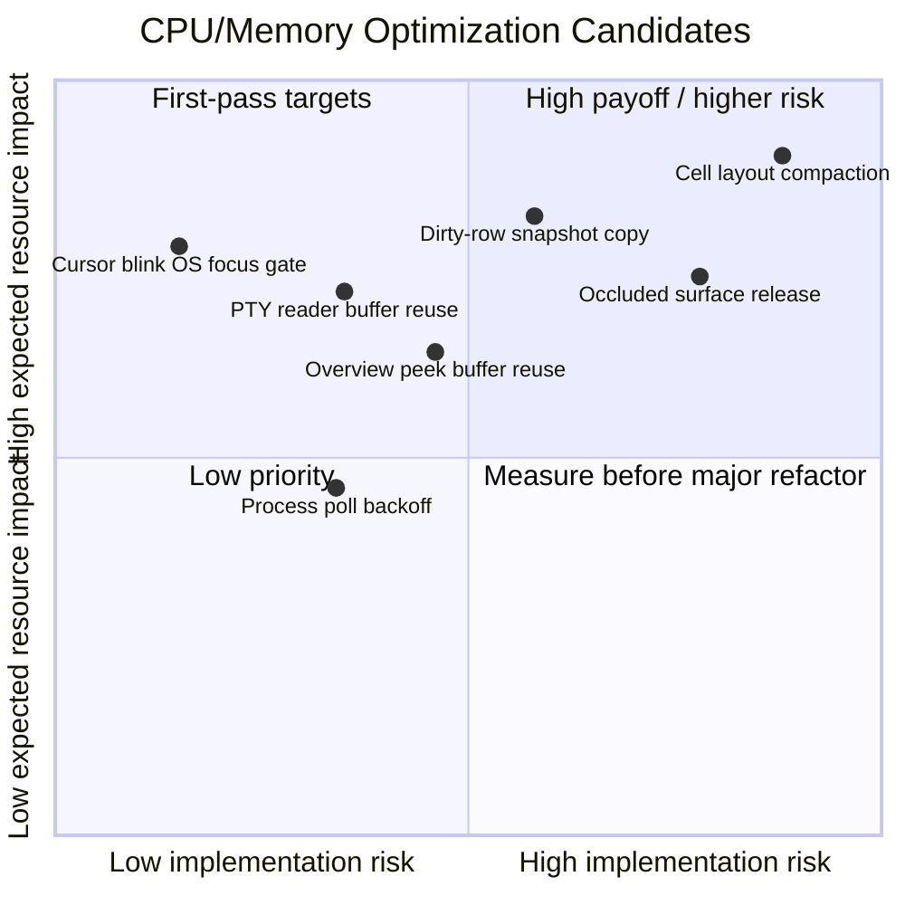

# CPU/メモリ改善候補マトリックス

## Title

`noa` CPU/メモリ改善候補マトリックス

## Purpose

CPU使用率・メモリ使用率の改善候補を、期待効果、影響範囲、実装リスクで
並べ、最初に実測・実装する対象を選びやすくする。

## Target

`noa-app`, `noa-grid`, `noa-render`, `noa-pty`, `noa-font` を触る
メンテナ。

## Format

Mermaid `quadrantChart`、Markdown 表、ASCII fallback。

## Abstraction

プロファイル取得前の計画ビュー。定量値はソース構造と既知定数からの概算で、
実測値ではない。

## Diagram Code



## ASCII Fallback

```text
期待効果
高    | [1] カーソル点滅gate       [2] dirty行snapshot copy       [7] Cell layout縮小
      | [4] PTY reader buffer再利用 [3] overview peek再利用        [6] occluded surface解放
中    | [5] process poll backoff
低    |
      +------------------------------------------------------------------------------------------
        低リスク                         中リスク                         高リスク
```

## Legend

| ID | 候補 |
| --- | --- |
| 1 | OS focus / occlusion によるカーソル点滅 gate |
| 2 | dirty 行だけの visible snapshot copy |
| 3 | overview `FrameSnapshot::peek` の再利用バッファ化 |
| 4 | PTY reader の buffer reuse / pooling |
| 5 | foreground process polling の backoff |
| 6 | occluded window surface の release / unconfigure |
| 7 | `Cell` layout compaction |

リスク尺度:

- 低: 局所変更で、挙動契約が明確。テスト範囲も小さい。
- 中: hot path のデータフローや cache 挙動を変える。焦点を絞ったテストが必要。
- 高: 表現、所有権、GPU lifecycle、または広い不変条件を変える。

効果尺度:

- 高: idle/background CPU、大量出力CPU、GPUメモリ、memory bandwidth のいずれかに
  目に見える影響が出る可能性が高い。
- 中: workload 依存だが、狙った scenario では測定可能。
- 低: 上位候補のボトルネックを否定した後で扱う程度。

## Matrix

| ID | 項目 | 効果: 定量 | 効果: 定性 | 影響範囲 | リスク |
| --- | --- | --- | --- | --- | --- |
| 1 | OS focus が無い状態でも cursor blink が継続する | sticky focused window あたり最大 600ms ごとに 1 wake/redraw request。約 1.67Hz。terminal lock と GPU present が乗る可能性がある。 | background/idle 時の無駄な wake と描画を消せる。最も低リスクな CPU 改善候補。 | `noa-app` timer loop と focused pane cursor redraw。 | 低。unfocused pane の hollow cursor と、focus/input 復帰時の blink 再開を保つ必要がある。 |
| 2 | visible snapshot が clean 行も毎 frame 全コピーする | 200 x 50 grid、`Cell <= 64B` なら live cell copy は pane/snapshot あたり約 640KiB。row/vector overhead を含めるとさらに増える。複数 pane や高 redraw rate で memory bandwidth 圧になる。 | 変更行が少ない frame の terminal lock 時間と steady memcpy を減らせる。 | `noa-grid::Screen`, `noa-render::FrameSnapshot`, renderer row-cache invalidation。 | 中。scrollback viewport、resize、row-base shift、selection/search invalidation、初回 snapshot を壊さない設計が必要。 |
| 3 | overview `FrameSnapshot::peek` が visible rows を deep clone する | ID 2 と同じ visible-grid 規模の copy が overview publish ごとに発生。overview visible かつ tile throttle 10Hz で制限される。 | Session Overview を開いたまま active output するケースの lock time と allocation/copy cost を下げられる。 | `noa-app` IO thread overview publish path と `noa-render::FrameSnapshot::peek`。 | 中。`Arc<FrameSnapshot>` publish-slot semantics があるため、単純な in-place mutation は危険。scratch/double-buffer 所有権が必要になりそう。 |
| 4 | PTY reader が read ごとに `Box<[u8]>` を確保する | read ごとに最大 64KiB を allocate/copy。PTY event queue は 1024 events で bounded なので、queued payload は概算で最大 64MiB + overhead。 | bulk output 時の allocator churn を減らし、throughput 改善も期待できる。 | `noa-pty` reader と `PtyEvent::Data` ownership model。API を保てれば downstream IO thread は小変更で済む。 | 中低。pooling は bounded にしないと burst 後に 64KiB buffer を多数保持して逆効果になり得る。 |
| 5 | foreground process name polling が固定 1秒間隔で走る | pane あたり約 1 probe/sec。50 panes なら idle でも約 50 foreground-process polls/sec。 | 多 pane idle session の wakeup/syscall を減らせる。 | `noa-app::branch_poll` worker、session metadata、agent-bell process classification。 | 中。polling は意図的に sidebar visibility で止めていない。focus、output、process change、pane lifecycle で backoff reset が必要。 |
| 6 | occluded window が configured surface を保持し続ける | 3840 x 2160 RGBA texture は約 31.6MiB。double/triple buffering なら tab あたり概算 63-95MiB 級。ただし実際の Metal/wgpu residency は要測定。 | 高解像度・多 tab 利用で GPU memory footprint を減らせる可能性がある。 | `WindowState` surface lifecycle、resize/reconfigure path、macOS tab occlusion、overview host assumptions。 | 高。wgpu 27 は public API として明確な `Surface::unconfigure` が見当たらない。`Option<Surface>` 化や recreate/configure sequencing が必要になり得る。 |
| 7 | `Cell` が combining text と hyperlink index を広い inline layout で持つ | 64B から 48B 程度に縮められれば live cell あたり 16B 削減。200 x 50 grid で live grid または snapshot copy あたり約 160KiB 削減。pane/snapshot 数に乗算で効く。packed scrollback は既に 8B/cell なので主対象外。 | hot terminal state と snapshot copy 全体の retained size を構造的に下げられる。 | `noa-grid::Cell`、row clone/reuse、renderer/search/url/scrollback materialization。 | 高。`String` は現在 `clone_from` で buffer reuse できる。`Option<Box<str>>` は size を下げても churn を増やす可能性がある。`Option<u32>` は niche 型、例: `Option<NonZeroU32>`、でないと期待通り詰まらない可能性がある。 |

## Recommended Order

1. ID 1 を最初に実装・検証する。
   - 局所的で、background idle CPU への仮説が明確。
   - 受け入れ指標: backgrounded app が cursor blink だけの理由で
     blink interval ごとに wake しない。

2. 次に ID 2 と ID 4 を測定する。
   - ID 2 は render path の memory bandwidth と lock hold time が対象。
   - ID 4 は bulk PTY output の allocator churn が対象。

3. Session Overview を active output 中によく使うなら ID 3 の優先度を上げる。
   - そうでなければ ID 2 の後でよい。どちらも snapshot copy に触るが、
     ID 2 は主描画経路に効く。

4. ID 5 は多 pane idle 最適化として扱う。
   - 1, 10, 50 pane の idle scenario で検証する。

5. ID 6 と ID 7 は quick fix ではなく、実測付き design change として扱う。
   - どちらも memory 効果は大きい可能性があるが、lifecycle または
     data representation の不変条件に触る。

## 対応チェックリスト

### 共通準備

- [x] `IMPL-PERF-000`: 対象 workload を決める。
  - 例: background idle、bulk PTY output、Session Overview + active output、
    many-pane idle、高解像度多 tab。
  - `docs/performance-measurements.md` に W1-W7 として定義した。
- [ ] `IMPL-PERF-001`: 変更前 baseline を保存する。
  - CPU: wakeup 数、redraw request 数、frame time、main-thread CPU。
  - メモリ: RSS、GPU memory、allocation count、allocation bytes。
- [x] `IMPL-PERF-002`: 変更ごとの測定コマンド、手順、結果メモの置き場所を決める。
  - 測定手順と結果メモの追記先は `docs/performance-measurements.md`。
- [x] `IMPL-PERF-003`: `cargo fmt --all` と対象 crate の test 範囲を確認する。

### ID 1: Cursor blink OS focus gate

- [ ] `IMPL-PERF-101`: `tick_cursor_blink` の現状 baseline を取る。
  - backgrounded app で 600ms 周期の wake/redraw が残るか確認する。
- [x] `IMPL-PERF-102`: `focused_cursor_wants_blink` に `os_focused` と `occluded` の gate を追加する。
- [x] `IMPL-PERF-103`: OS focus 復帰、window focus 切替、occluded 復帰で cursor 表示が破綻しないことを確認する。
- [ ] `IMPL-PERF-104`: backgrounded app が cursor blink だけで wake しないことを確認する。
- [x] `IMPL-PERF-105`: 関連 unit test を追加または既存 test を更新する。

### ID 2: Dirty-row-only visible snapshot copy

- [ ] `IMPL-PERF-201`: 1行更新、連続 scroll、selection/search ありの baseline を取る。
- [x] `IMPL-PERF-202`: `FrameSnapshot` の rows reuse 前提と row-base 変化時の invalidation 条件を整理する。
- [x] `IMPL-PERF-203`: clean 行 copy を避ける最小設計を決める。
  - 前回 snapshot row を保持するか、dirty mask と renderer cache だけで十分かを判断する。
- [x] `IMPL-PERF-204`: scrollback viewport、resize、alt screen、search/selection の回帰 test を追加する。
- [ ] `IMPL-PERF-205`: terminal lock hold time と copy bytes が baseline より下がることを確認する。

### ID 3: Overview `FrameSnapshot::peek` reuse

- [ ] `IMPL-PERF-301`: Session Overview visible + active output の baseline を取る。
- [x] `IMPL-PERF-302`: publish-slot の `Arc<FrameSnapshot>` 所有権を壊さない reuse 方式を選ぶ。
  - 候補: io thread 内 scratch buffer、double buffer、または `peek_into` + publish clone 境界。
- [x] `IMPL-PERF-303`: overview が source tab を直接 lock しない要件を維持する。
- [x] `IMPL-PERF-304`: overview tile 更新、occluded source tab、trailing flush の test を通す。
- [ ] `IMPL-PERF-305`: overview publish 時の allocation/copy が baseline より下がることを確認する。

### ID 4: PTY reader buffer reuse / pooling

- [ ] `IMPL-PERF-401`: bulk output で `Box<[u8]>` allocation count/bytes の baseline を取る。
- [x] `IMPL-PERF-402`: buffer reuse の上限を決める。
  - burst 後に 64KiB buffer が大量常駐しないことを完了条件に含める。
- [x] `IMPL-PERF-403`: `PtyEvent::Data` の所有権 model を維持するか、変更範囲を明示する。
- [x] `IMPL-PERF-404`: EOF/error、receiver dropped、bounded queue full の挙動を確認する。
- [ ] `IMPL-PERF-405`: bulk output throughput と allocation churn が baseline より改善することを確認する。

### ID 5: Foreground process polling backoff

- [ ] `IMPL-PERF-501`: 1/10/50 pane idle で poll 回数、CPU、wakeup の baseline を取る。
- [x] `IMPL-PERF-502`: process name が安定した pane の backoff policy を決める。
  - reset trigger: process name 変化、pane spawn/exit、probe register。
- [x] `IMPL-PERF-503`: agent-bell / attention escalation の遅延許容を明記する。
- [x] `IMPL-PERF-504`: process 表示更新と attention 判定の回帰 test を追加する。
- [ ] `IMPL-PERF-505`: many-pane idle で poll 回数と wakeup が baseline より下がることを確認する。

### ID 6: Occluded window surface release

- [ ] `IMPL-PERF-601`: 高解像度 + 多 tab で GPU memory baseline を取る。
- [x] `IMPL-PERF-602`: wgpu 27 の public API で surface を安全に解放・再構成できる方式を確認する。
  - `Surface::unconfigure` ではなく、occluded 中だけ `Surface::configure` へ渡す effective config を 1x1 に縮める。
- [x] `IMPL-PERF-603`: `WindowState` の `surface` / `surface_config` / `renderer` lifecycle 変更範囲を設計する。
  - `surface_config` は論理的な最新 window size として保持し、実際の configure size だけ occluded gate で切り替える。
- [ ] `IMPL-PERF-604`: occluded/unoccluded、resize、scale factor change、overview host の回帰 scenario を確認する。
- [ ] `IMPL-PERF-605`: 再表示 latency と GPU memory 削減量の tradeoff を記録する。

### ID 7: `Cell` layout compaction

- [x] `IMPL-PERF-701`: `std::mem::size_of::<Cell>()` と representative grid/snapshot memory の baseline を取る。
- [x] `IMPL-PERF-702`: `combining` と `hyperlink` の候補型を比較する。
  - 例: `String`, `Option<Box<str>>`, small inline buffer, `Option<NonZeroU32>`。
- [x] `IMPL-PERF-703`: `clone_from` による combining buffer reuse を失わないことを確認する。
  - `combining: String` は維持し、`clone_from` / `set_from` の buffer reuse を失わない設計にした。
- [x] `IMPL-PERF-704`: wide cell、combining、hyperlink、scrollback materialization、search/url の回帰 test を追加する。
- [ ] `IMPL-PERF-705`: retained size が下がり、主要 workload の CPU/alloc が悪化しないことを確認する。

## Explanation

最初の候補として最も強いのは ID 1。既存の app state は sticky logical focus と
real OS focus をすでに分けているため、小さな gate で background / occluded 時の
cursor blink wakeup を避けられる。

ID 2 と ID 3 はどちらも row snapshot copy cost を扱う。ID 2 は通常の terminal
draw path に効くため、影響範囲はより広い。ID 3 は Session Overview が visible
のとき重要で、primary path の recycled row buffer を使わず `peek` が deep clone
している点が焦点。

ID 4 は rendering と独立しており、bulk PTY output で測りやすい。event queue は
bounded なので queued payload の上限はあるが、sustained output では per-read
allocation が allocator sample に出る可能性が高い。

ID 5 は主に idle wakeup 削減。現在の behavior は意図的で、process state は
sidebar hidden 時にも session metadata と agent attention に使われるため、
backoff しても semantics を保つ必要がある。

ID 6 と ID 7 は memory 効果が大きい可能性があるが、変更幅も大きい。ID 6 は
wgpu surface lifecycle と macOS tab occlusion behavior に制約される。ID 7 は
基礎データ構造を変えるため、retained size を下げても allocation churn を増やす
可能性があり、bench が必須。

## Sources

- `crates/noa-app/src/app.rs`
- `crates/noa-app/src/app/timers.rs`
- `crates/noa-app/src/app/render.rs`
- `crates/noa-app/src/app/event_loop.rs`
- `crates/noa-app/src/app/state.rs`
- `crates/noa-app/src/branch_poll.rs`
- `crates/noa-app/src/io_thread.rs`
- `crates/noa-grid/src/screen/text.rs`
- `crates/noa-grid/src/cell.rs`
- `crates/noa-grid/src/scrollback.rs`
- `crates/noa-render/src/snapshot.rs`
- `crates/noa-pty/src/reader.rs`
- `crates/noa-pty/src/pty.rs`
