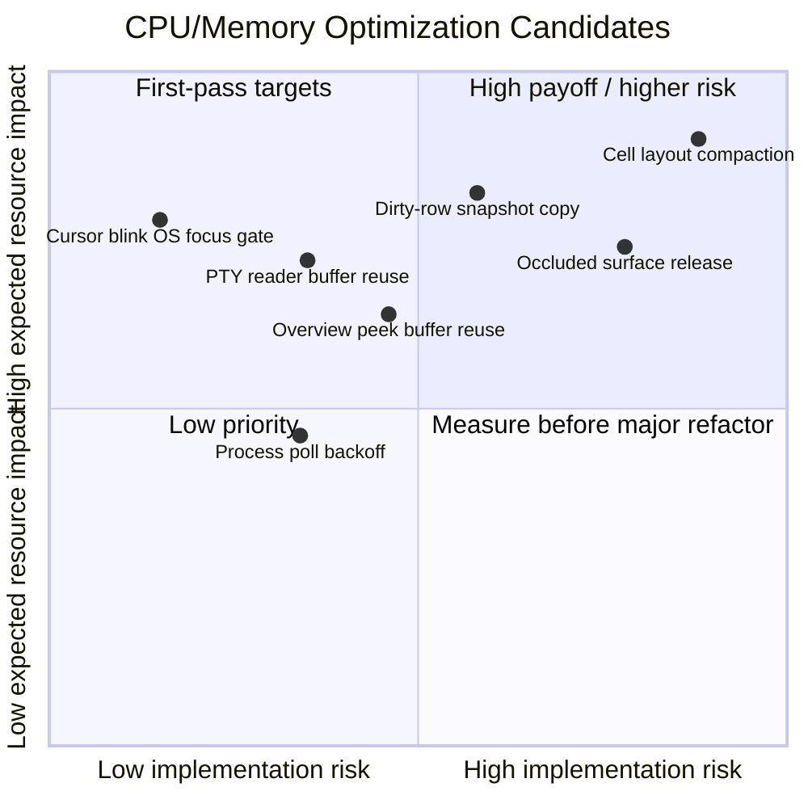

# CPU/Memory Optimization Candidate Matrix

## Title

`noa` CPU/Memory Optimization Candidate Matrix

## Purpose

Rank CPU/memory usage optimization candidates by expected payoff, blast
radius, and implementation risk, to make it easy to pick what to measure
and implement first.

## Target

Maintainers who touch `noa-app`, `noa-grid`, `noa-render`, `noa-pty`,
`noa-font`.

## Format

Mermaid `quadrantChart`, Markdown table, ASCII fallback.

## Abstraction

This is a planning view produced before profiling. The quantitative
values are estimates derived from source structure and known constants,
not measured values.

## Diagram Code



## ASCII Fallback

```text
Expected payoff
High  | [1] Cursor blink gate       [2] Dirty-row snapshot copy      [7] Cell layout shrink
      | [4] PTY reader buffer reuse [3] Overview peek reuse          [6] Occluded surface release
Mid   | [5] Process poll backoff
Low   |
      +------------------------------------------------------------------------------------------
        Low risk                        Medium risk                      High risk
```

## Legend

| ID | Candidate |
| --- | --- |
| 1 | Cursor blink gate driven by OS focus / occlusion |
| 2 | Visible snapshot copy limited to dirty rows only |
| 3 | Reusable buffer for overview `FrameSnapshot::peek` |
| 4 | PTY reader buffer reuse / pooling |
| 5 | Backoff for foreground process polling |
| 6 | Release / unconfigure occluded window surfaces |
| 7 | `Cell` layout compaction |

Risk scale:

- Low: A localized change with a clear behavioral contract. Small test surface.
- Medium: Changes hot-path data flow or cache behavior. Needs focused testing.
- High: Changes representation, ownership, GPU lifecycle, or a wide invariant.

Payoff scale:

- High: Likely to have a visible impact on at least one of idle/background
  CPU, high-volume-output CPU, GPU memory, or memory bandwidth.
- Medium: Workload-dependent, but measurable in a targeted scenario.
- Low: Worth addressing only after ruling out higher-priority bottlenecks.

## Matrix

| ID | Item | Effect: Quantitative | Effect: Qualitative | Blast Radius | Risk |
| --- | --- | --- | --- | --- | --- |
| 1 | Cursor blink keeps running even without OS focus | Up to 1 wake/redraw request every 600ms per sticky-focused window, roughly 1.67Hz. This can carry a terminal lock and a GPU present along with it. | Removes wasted wakes and redraws during background/idle time. The lowest-risk CPU optimization candidate. | `noa-app` timer loop and focused-pane cursor redraw. | Low. Must preserve the hollow cursor for unfocused panes and resume blinking on focus/input return. |
| 2 | The visible snapshot fully copies clean rows every frame | With a 200 x 50 grid and `Cell <= 64B`, the live cell copy is roughly 640KiB per pane/snapshot. Row/vector overhead adds more on top. Becomes memory-bandwidth pressure with multiple panes or a high redraw rate. | Reduces terminal-lock hold time and steady-state memcpy on frames with few changed rows. | `noa-grid::Screen`, `noa-render::FrameSnapshot`, renderer row-cache invalidation. | Medium. Must not break scrollback viewport, resize, row-base shift, selection/search invalidation, or the initial snapshot. |
| 3 | Overview `FrameSnapshot::peek` deep-clones visible rows | Same visible-grid-scale copy as ID 2, happening on every overview publish. Bounded by overview visibility and a 10Hz tile throttle. | Lowers lock time and allocation/copy cost while Session Overview stays open during active output. | `noa-app` IO thread overview publish path and `noa-render::FrameSnapshot::peek`. | Medium. Publish-slot `Arc<FrameSnapshot>` ownership semantics make naive in-place mutation risky; a scratch/double-buffer ownership model is likely needed. |
| 4 | PTY reader allocates a `Box<[u8]>` on every read | Up to 64KiB allocated/copied per read. The PTY event queue is bounded at 1024 events, so queued payload is roughly bounded at 64MiB + overhead at most. | Reduces allocator churn on bulk output and could also improve throughput. | `noa-pty` reader and `PtyEvent::Data` ownership model. Downstream IO thread changes should be small if the API is preserved. | Medium-low. Pooling must be bounded, or it could hold onto many 64KiB buffers after a burst and become counterproductive. |
| 5 | Foreground process name polling runs on a fixed 1-second interval | Roughly 1 probe/sec per pane. With 50 panes, that's about 50 foreground-process polls/sec even at idle. | Reduces wakeups/syscalls for idle sessions with many panes. | `noa-app::branch_poll` worker, session metadata, agent-bell process classification. | Medium. Polling is intentionally not stopped by sidebar visibility. Backoff must reset on focus, output, process change, and pane lifecycle events. |
| 6 | Occluded windows keep holding a configured surface | A 3840 x 2160 RGBA texture is about 31.6MiB. With double/triple buffering that's roughly 63-95MiB class per tab, though actual Metal/wgpu residency needs measurement. | Could reduce GPU memory footprint for high-resolution, multi-tab usage. | `WindowState` surface lifecycle, resize/reconfigure path, macOS tab occlusion, overview host assumptions. | High. wgpu 27 has no clear public `Surface::unconfigure` API. May require an `Option<Surface>` model or recreate/configure sequencing. |
| 7 | `Cell` holds combining text and hyperlink index in a wide inline layout | Shrinking from 64B to roughly 48B saves 16B per live cell. On a 200 x 50 grid that's about 160KiB saved per live grid or snapshot copy, multiplied across pane/snapshot count. Packed scrollback is already 8B/cell, so it's mostly out of scope. | Structurally lowers retained size across hot terminal state and snapshot copies. | `noa-grid::Cell`, row clone/reuse, renderer/search/url/scrollback materialization. | High. `String` currently supports buffer reuse via `clone_from`. `Option<Box<str>>` shrinks size but may increase churn. `Option<u32>` needs a niche type — e.g. `Option<NonZeroU32>` — to pack as expected. |

## Recommended Order

1. Implement and validate ID 1 first.
   - Localized, with a clear hypothesis about background idle CPU.
   - Acceptance criterion: a backgrounded app does not wake every blink
     interval solely for cursor blink.

2. Next, measure ID 2 and ID 4.
   - ID 2 targets render-path memory bandwidth and lock hold time.
   - ID 4 targets allocator churn on bulk PTY output.

3. Raise ID 3's priority if Session Overview is commonly used during
   active output.
   - Otherwise it can follow ID 2. Both touch snapshot copying, but
     ID 2 affects the primary rendering path.

4. Treat ID 5 as a many-pane idle optimization.
   - Validate against idle scenarios with 1, 10, and 50 panes.

5. Treat ID 6 and ID 7 as design changes requiring measurement, not
   quick fixes.
   - Both may have a large memory payoff, but touch lifecycle or data
     representation invariants.

## Implementation Checklist

### Common Prep

- [x] `IMPL-PERF-000`: Decide on target workloads.
  - E.g. background idle, bulk PTY output, Session Overview + active
    output, many-pane idle, high-resolution multi-tab.
  - Defined as W1-W7 in `docs/performance-measurements.md`.
- [ ] `IMPL-PERF-001`: Save a pre-change baseline.
  - CPU: wakeup count, redraw request count, frame time, main-thread CPU.
  - Memory: RSS, GPU memory, allocation count, allocation bytes.
- [x] `IMPL-PERF-002`: Decide where to record the measurement command,
  procedure, and results for each change.
  - Measurement procedures and results go into
    `docs/performance-measurements.md`.
- [x] `IMPL-PERF-003`: Verify `cargo fmt --all` and the relevant crate's
  test scope.

### ID 1: Cursor blink OS focus gate

- [ ] `IMPL-PERF-101`: Capture the current baseline for
  `tick_cursor_blink`.
  - Confirm whether the 600ms-cycle wake/redraw persists for a
    backgrounded app.
- [x] `IMPL-PERF-102`: Add `os_focused` and `occluded` gates to
  `focused_cursor_wants_blink`.
- [x] `IMPL-PERF-103`: Confirm cursor display doesn't break across OS
  focus return, window focus switching, and occlusion return.
- [ ] `IMPL-PERF-104`: Confirm a backgrounded app doesn't wake solely
  for cursor blink.
- [x] `IMPL-PERF-105`: Add or update relevant unit tests.

### ID 2: Dirty-row-only visible snapshot copy

- [ ] `IMPL-PERF-201`: Capture baselines for single-row updates,
  continuous scroll, and with selection/search active.
- [x] `IMPL-PERF-202`: Clarify `FrameSnapshot`'s row-reuse assumptions
  and the invalidation conditions on row-base changes.
- [x] `IMPL-PERF-203`: Decide the minimal design that avoids copying
  clean rows.
  - Decide whether to keep the previous snapshot's rows, or whether a
    dirty mask plus renderer cache is sufficient.
- [x] `IMPL-PERF-204`: Add regression tests for scrollback viewport,
  resize, alt screen, and search/selection.
- [ ] `IMPL-PERF-205`: Confirm terminal-lock hold time and copy bytes
  drop below baseline.

### ID 3: Overview `FrameSnapshot::peek` reuse

- [ ] `IMPL-PERF-301`: Capture the baseline for Session Overview
  visible + active output.
- [x] `IMPL-PERF-302`: Choose a reuse approach that doesn't break the
  publish-slot `Arc<FrameSnapshot>` ownership.
  - Candidates: an in-thread scratch buffer on the IO thread, double
    buffering, or a `peek_into` + publish-clone boundary.
- [x] `IMPL-PERF-303`: Preserve the requirement that overview never
  locks the source tab directly.
- [x] `IMPL-PERF-304`: Pass tests for overview tile updates, occluded
  source tab, and trailing flush.
- [ ] `IMPL-PERF-305`: Confirm allocation/copy on overview publish drops
  below baseline.

### ID 4: PTY reader buffer reuse / pooling

- [ ] `IMPL-PERF-401`: Capture baseline `Box<[u8]>` allocation
  count/bytes for bulk output.
- [x] `IMPL-PERF-402`: Decide the upper bound for buffer reuse.
  - Completion criterion includes not retaining many 64KiB buffers
    after a burst.
- [x] `IMPL-PERF-403`: Preserve the `PtyEvent::Data` ownership model, or
  clearly document the scope of any change.
- [x] `IMPL-PERF-404`: Confirm behavior for EOF/error, receiver
  dropped, and bounded-queue-full.
- [ ] `IMPL-PERF-405`: Confirm bulk-output throughput and allocation
  churn improve over baseline.

### ID 5: Foreground process polling backoff

- [ ] `IMPL-PERF-501`: Capture baseline poll count, CPU, and wakeups for
  1/10/50-pane idle.
- [x] `IMPL-PERF-502`: Decide the backoff policy for panes with a
  stable process name.
  - Reset triggers: process name change, pane spawn/exit, probe
    register.
- [x] `IMPL-PERF-503`: Document the acceptable delay for agent-bell /
  attention escalation.
- [x] `IMPL-PERF-504`: Add regression tests for process display updates
  and attention determination.
- [ ] `IMPL-PERF-505`: Confirm poll count and wakeups drop below
  baseline for many-pane idle.
  - 2026-07-09: Confirmed a 75% reduction in stable poll count via the
    `process_poll` unit test and the W5 log. Wakeups/sec still awaits an
    on-device idle run.

### ID 6: Occluded window surface release

- [ ] `IMPL-PERF-601`: Capture the GPU memory baseline for high
  resolution + many tabs.
- [x] `IMPL-PERF-602`: Confirm a way to safely release/reconfigure the
  surface using wgpu 27's public API.
  - Instead of `Surface::unconfigure`, shrink the effective config
    passed to `Surface::configure` to 1x1 only while occluded.
- [x] `IMPL-PERF-603`: Design the scope of change to `WindowState`'s
  `surface` / `surface_config` / `renderer` lifecycle.
  - Keep `surface_config` as the logical latest window size, and only
    switch the actual configure size via the occlusion gate.
- [ ] `IMPL-PERF-604`: Confirm regression scenarios for
  occluded/unoccluded, resize, scale factor change, and overview host.
  - 2026-07-09: Saved unit-level occlusion config / overview redraw
    gate confirmation in the W6 log. An on-device
    reveal/resize/scale-factor/overview visual run has not been done
    yet.
- [ ] `IMPL-PERF-605`: Record the tradeoff between reveal latency and
  GPU memory savings.

### ID 7: `Cell` layout compaction

- [x] `IMPL-PERF-701`: Capture the baseline for
  `std::mem::size_of::<Cell>()` and representative grid/snapshot memory.
- [x] `IMPL-PERF-702`: Compare candidate types for `combining` and
  `hyperlink`.
  - E.g. `String`, `Option<Box<str>>`, a small inline buffer,
    `Option<NonZeroU32>`.
- [x] `IMPL-PERF-703`: Confirm combining-buffer reuse via `clone_from`
  isn't lost.
  - Kept `combining: String` and designed to preserve `clone_from` /
    `set_from` buffer reuse.
- [x] `IMPL-PERF-704`: Add regression tests for wide cells, combining,
  hyperlink, scrollback materialization, and search/url.
- [ ] `IMPL-PERF-705`: Confirm retained size drops without regressing
  CPU/alloc on major workloads.
  - 2026-07-09: Saved the W7 quick probe in
    `docs/performance-measurements.md`. `Cell` went from 64B to 48B,
    bulk print stayed roughly equivalent. Scrollback push came out
    lower, so this is not marked complete pending further measurement.

## Explanation

ID 1 is the strongest first candidate. The existing app state already
separates sticky logical focus from real OS focus, so a small gate
avoids cursor-blink wakeups while background/occluded.

ID 2 and ID 3 both deal with row-snapshot copy cost. ID 2 affects the
normal terminal draw path, so its blast radius is broader. ID 3 matters
when Session Overview is visible; the key issue is that `peek`
deep-clones instead of using the primary path's recycled row buffer.

ID 4 is independent of rendering and easy to measure with bulk PTY
output. The event queue is bounded, so queued payload has a ceiling,
but per-read allocation is likely to show up in allocator samples under
sustained output.

ID 5 is mainly about reducing idle wakeups. The current behavior is
intentional — process state is also used for session metadata and
agent attention even when the sidebar is hidden — so backoff must
preserve those semantics.

ID 6 and ID 7 may have a large memory payoff but also a large change
footprint. ID 6 is constrained by wgpu surface lifecycle and macOS tab
occlusion behavior. ID 7 changes a foundational data structure, so
shrinking retained size could increase allocation churn; benchmarking
is essential.

## Sources

- `crates/noa-app/src/app.rs`
- `crates/noa-app/src/app/timers.rs`
- `crates/noa-app/src/app/render.rs`
- `crates/noa-app/src/app/event_loop.rs`
- `crates/noa-app/src/app/state.rs`
- `crates/noa-app/src/branch_poll.rs`
- `crates/noa-app/src/io_thread.rs`
- `crates/noa-grid/src/screen/text.rs`
- `crates/noa-grid/src/cell.rs`
- `crates/noa-grid/src/scrollback.rs`
- `crates/noa-render/src/snapshot.rs`
- `crates/noa-pty/src/reader.rs`
- `crates/noa-pty/src/pty.rs`
